# Dockerhub link BE
https://hub.docker.com/repository/docker/dickyfahlevi21/be-simplewms
```bash
tag 1.1.0
```

## Step:

***Cara buat Docker Image, Docker container, Tag, dan push***
\
[Docker Documentataion](https://github.com/dickyfahlevi21/docker-doc)

***Cara pull mysql, akses mysql dari docker, buat db, buat network, dan connect network***
\
[Mysql Documentataion](https://github.com/dickyfahlevi21/mysql-doc)


***Install Docker-compose***
[Documentation Install Docker-compose](https://www.digitalocean.com/community/tutorials/how-to-install-and-use-docker-compose-on-ubuntu-20-04)

lalu buat ***docker-compose.yml***, dan import code berikut
```docker-compose.yml
version: "3.7"
services:
    mysql:
        container_name: mysql-compose
        image: mysql:latest
        environment: 
            - MYSQL_ROOT_PASSWORD=password
            - MYSQL_DATABASE=database_development
        ports:
            - 4444:3306
        networks:
            - network1
    be-simplewms:
        container_name: "be-simplewms"
        image: dickyfahlevi21/be-simplewms:1.0.0
        ports:
            - 5555:3000
        depends_on: 
            - mysql
        networks: 
            - network1

networks: 
    network1:
        name: network1
```

lalu run docker-compose tersebut dengan command berikut
```bash
docker-compose up --build
```

tetapi apabila mau run tanpa melihat log tersebut, jalankan command berikut
```bash
docker-compose up -d
```

langkah untuk masuk dan migrate secara manual 
```bash
docker exec -it [container id] bash
```

setelah masuk ke ***root@1753e3ba629c:/usr/src/app#***
\
lalu jalankan command berikut untuk migrate databasenya yang sudah dibuat
```bash
npx sequelize-cli db:migrate
```

# Backend Simple WMS

## Mockups Design: [FIGMA](https://www.figma.com/file/xZU0wwbhsbLdGLpCO6QFCP/Vuex?node-id=19%3A48)

## Api Documentation

-
-
-

### Sign Up

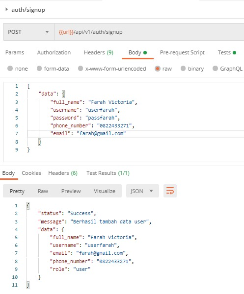

### Login

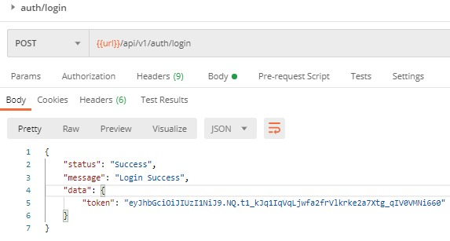

-
-
-

# GET

## Note: Untuk Endpoint dibawah ini, butuh 'token' Authorization dari login

-

### Get All Products

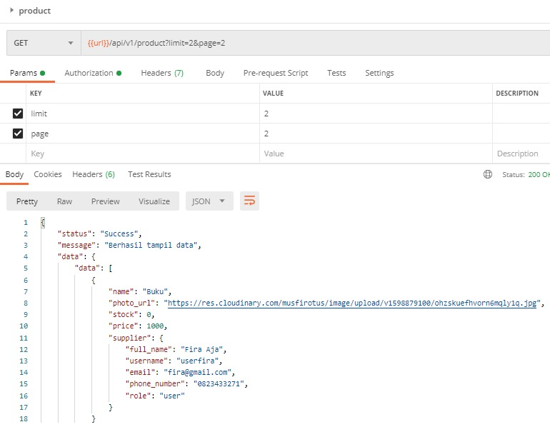

### Get All Products IN

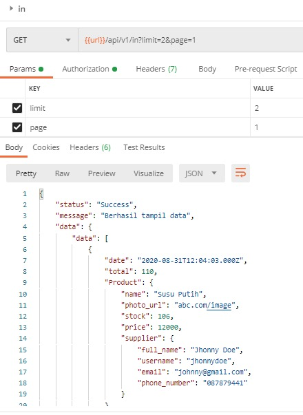

### Get All Products OUT

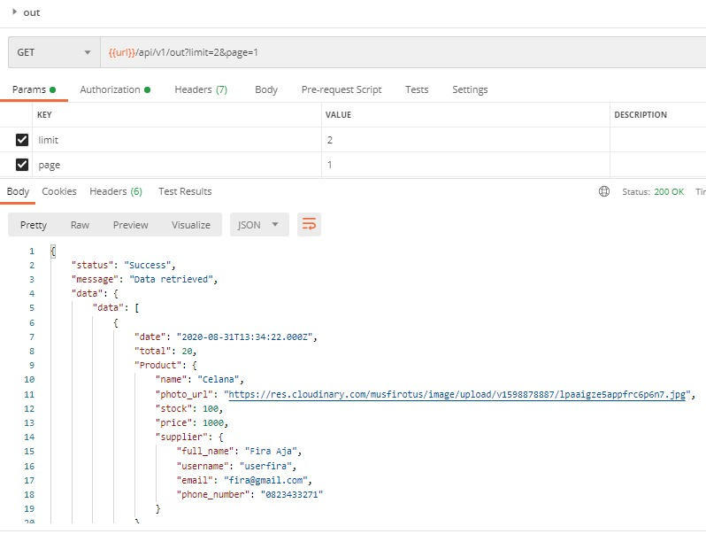

### Get User By id

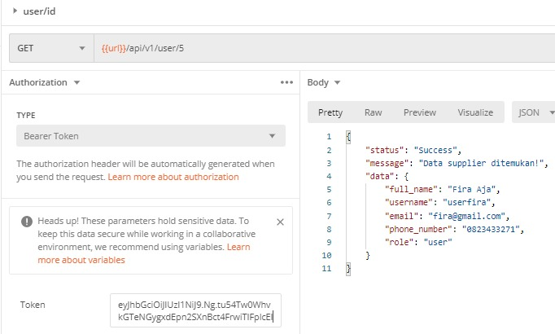

### Get Products By id

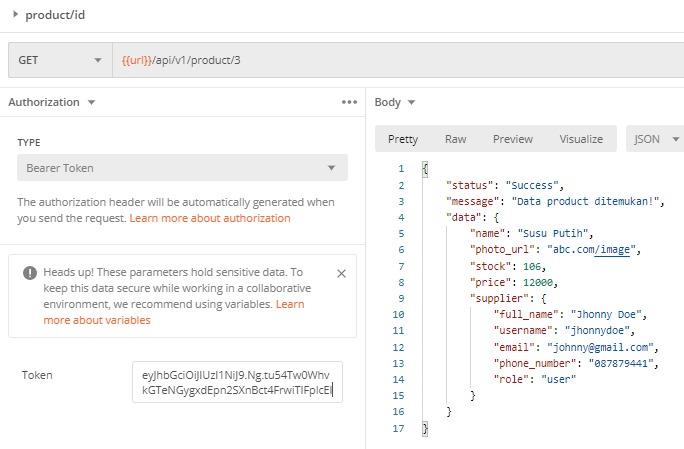

### Get Products IN By id

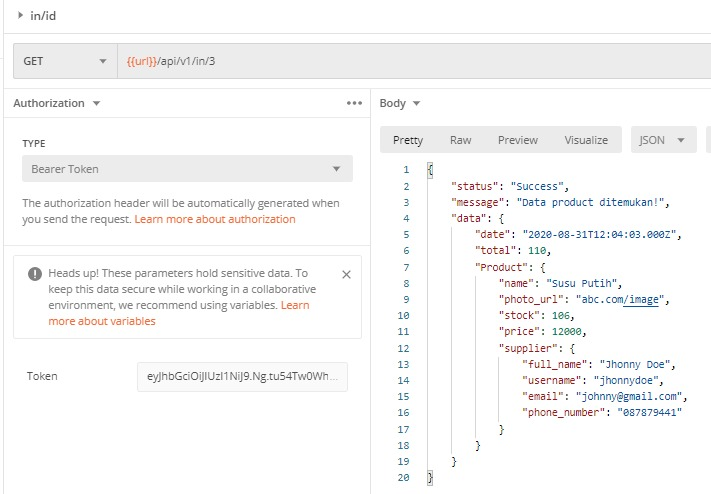

### Get Products OUT By id

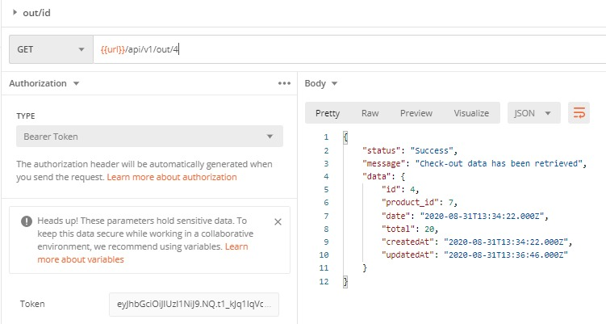

-
-
-

# POST

### POST User

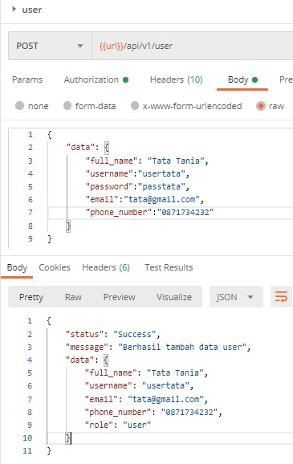

### POST Product

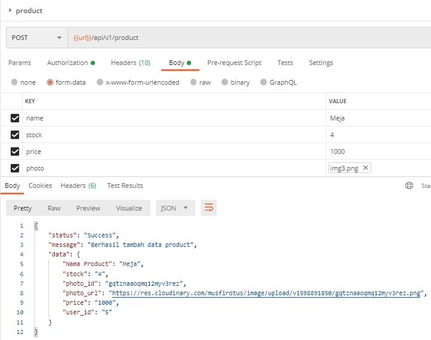

### POST Product IN

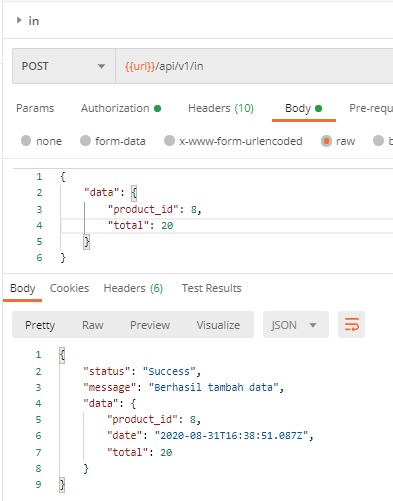

### POST Product OUT

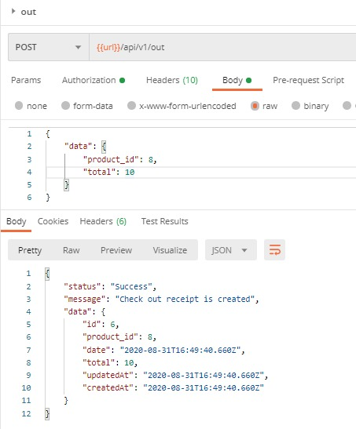

-
-
-

# PUT

### PUT - Update User By Id

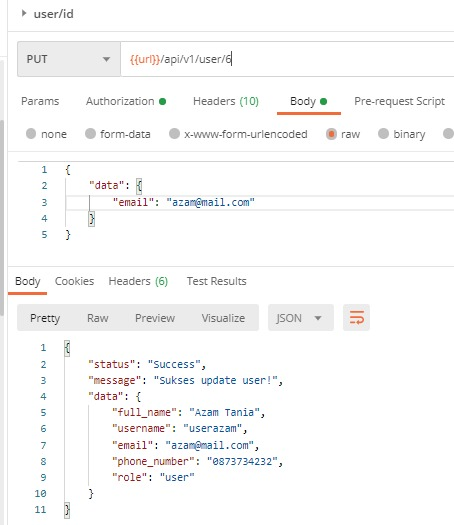

### PUT - Update Product By Id

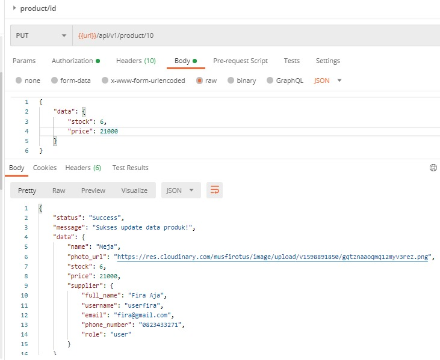

### PUT - Update Product IN By Id

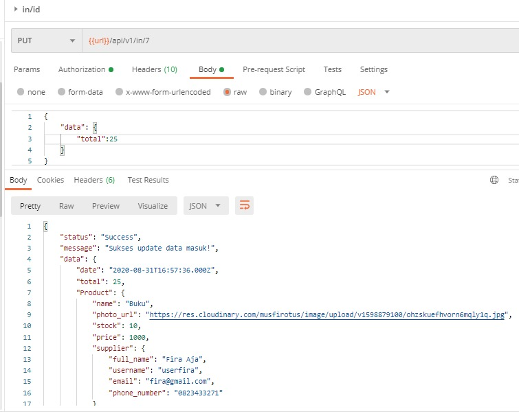

### PUT - Update Product OUT By Id

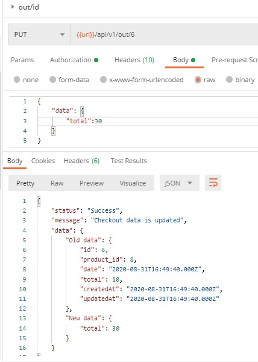

-
-
-

# DELETE

### DELETE User By id

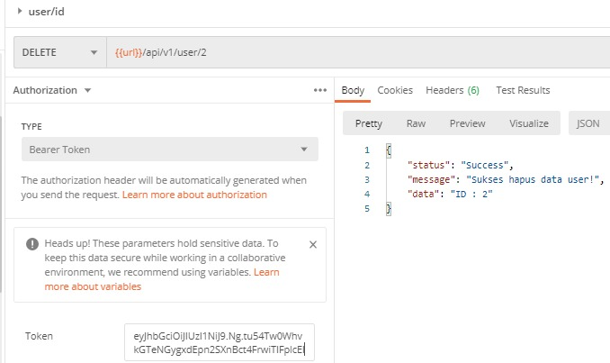

### DELETE Product By id

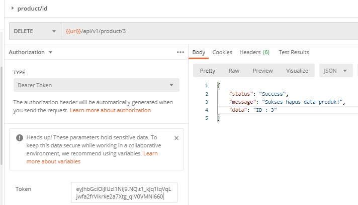

### DELETE Product IN By id

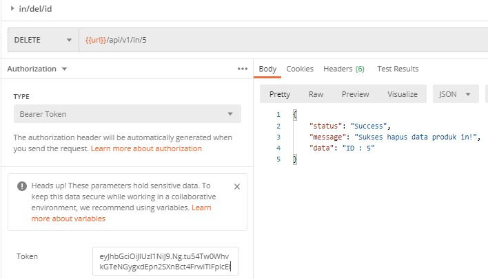

### DELETE Product OUT By id

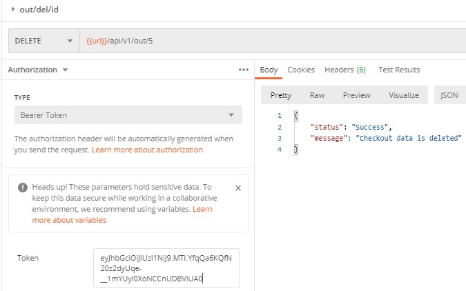

-
-
-

# HIT Endpoint for Download

### Download Laporan Product IN

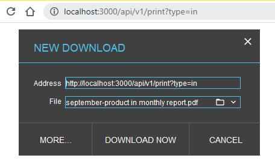

### Download Laporan Product OUT

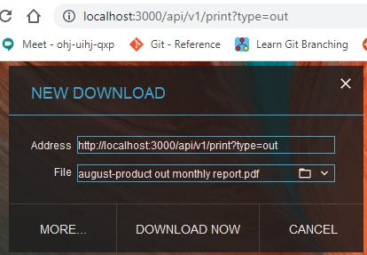

### Download Laporan Product ALL

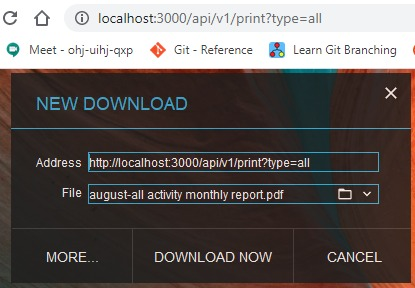
